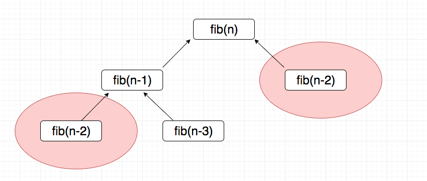

```python
( 20 + 5 )
( 16 / 4 )
```
Such expressions which denote procedures, are called ***combinations***. The left and the right elements are called ***operands***, and the element in the middle to indicate the operation is called ***operator***. This is the most common style we have seen by now; however there is another way to construct a procedure known as ***prefix notation***:
```python
( + 20 5 )
( / 16 4 )
```
Instead of injecting the operator between operands, which is a more human readable style, the prefix notation requires the operator always to be at the left most.<!-- more -->

conditions:
```python
( define ( abs x )
    ( cond (( > x 0 ) x )
           (( = x 0 ) 0 )
           (( < x 0 ) ( - x ))))
```
The general form can be expressed as:
>( cond (<\P1> <\E1>)
>       (<\P2> <\E2>)
>            ...
>       (<\Pn> <\En>))

If none of them is evaluated to be **true**, then the value of the **cond** will be **undefined**. It can also be simplified by using ***else***:
```python
( define ( abs x )
    ( cond (( < x 0 ) ( - x ))
           ( else  x )))
```
If there is only two ***predicates*** (the expression to be interpreted as either true of false), then it can use a special form ***if***:
```python
( define ( abs x )
    ( if ( < x 0 )
         ( - x )
         x ))
```
The general form of an ***if*** expression is:
>( if <\predicate> <\consequent> <\alternative> )

The logic operators:
>( and <\E1> ... <\En> )
>( or <\E1> ... <\En> )
>( not <E> )

Then use the logic operators to define a predicate to evaluate if a number id larger or equal to the other one:
```python
( define ( >= x y )
    ( or ( > x y ) ( = x y ))
```
That is all the syntax, **there is no loop in a functional programming language!**</br></br>
## Recursion
Considering the factorial function:
> n! = n ⋅ (n-1) ⋅ (n-2) ⋅ ... ⋅2⋅1

Which can be computed as:
> n! = n ⋅ (n-1)!

If we end it up with **1!**, then simply output **1**. Then the factorial function can be implemented in ***linear recursion***:
```python
( define ( factorial n )
    ( if ( = n 1 )
        1
        ( * n ( factorial ( - n 1 )))))
```
***Linear recursion*** defines that the computation chains of operations is proportional to n and hence grows linearly. There is also another pattern of recursion, known as ***Tree Recursion***. The best example will be the Fibonacci series, in which each element is the sum of the previous two:
```python
( define ( fib n )
    ( cond ( = n 0 ) 0 )
           ( = n 1 ) 1 )
           ( else ( + ( fib( - n 1 ) )
                      ( fib( - n 2 ) )))))
```
You may find out that this procedure is not really efficient because to compute **fib( - n 1)**, **fib( - n 2)** has to be computed one more time which causes duplicated work.

Therefore, instead of ***Tree Recursion***, let's try to convert it to be ***Linear Recursion***. Reasign the sum of **a** and **b** to **a**, and the previous **a** to **b**:
```python
( define ( fib n )
    ( iterate 1 0 n ))

( define ( iterate a b count )
    ( if ( = count 0 )
        b
        ( iterate ( + a b ) a ( - count 1 ))))
```